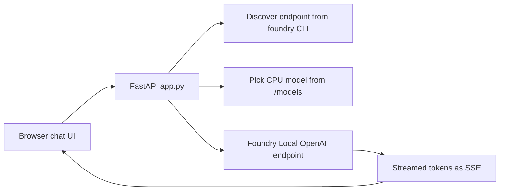

# Foundry Local Test

Web chat test app for a locally-running Foundry Local model — FastAPI streaming backend with a vanilla JS chat UI.

Run. Stream. Iterate.

[](https://github.com/JayRHa/foundry-local-test/stargazers)
[](https://github.com/JayRHa/foundry-local-test/network/members)
[](https://github.com/JayRHa/foundry-local-test/issues)
[](https://github.com/JayRHa/foundry-local-test/graphs/contributors)

Foundry Local | FastAPI | OpenAI-compatible | Streaming Chat UI

<p>
  <a href="https://jannikreinhard.com/">Blog</a> ·
  <a href="https://www.linkedin.com/in/jannik-r/">LinkedIn</a> ·
  <a href="https://x.com/jannik_reinhard">X</a>
</p>

## What is this?

Foundry Local Test is a small web app for poking at a model running locally through [Foundry Local](https://github.com/microsoft/Foundry-Local). It auto-discovers the OpenAI-compatible endpoint from `foundry service status`, picks a CPU build of the configured model (`qwen2.5-0.5b` by default), and serves a single-page chat UI on top of a streaming FastAPI backend.

It is intentionally minimal: no auth, no database, no build step. The point is to confirm a local model actually responds — token by token, with multi-turn history and a temperature control — before wiring it into anything bigger.

> On Apple Silicon the GPU variant tends to produce garbage output, so the app prefers the CPU build (`foundry model run qwen2.5-0.5b --device CPU`).

## How It Works



## Quick Start

```bash
git clone https://github.com/JayRHa/foundry-local-test.git
cd foundry-local-test

# Foundry Local service running + model cached
foundry service status
foundry model run qwen2.5-0.5b --device CPU

# Python deps
python -m venv .venv && source .venv/bin/activate
pip install foundry-local-sdk openai fastapi uvicorn

python app.py
```

Then open **http://127.0.0.1:8765** in the browser. The server auto-detects the endpoint and selected model and prints them on startup.

## Endpoints

| Route | Method | Purpose |
| --- | --- | --- |
| `/` | GET | Serve the chat UI (`static/index.html`). |
| `/api/info` | GET | Report the active model id, endpoint and device. |
| `/api/chat` | POST | Stream a chat completion back as Server-Sent Events. |

## Features

- 💬 Multi-turn chat with conversation history
- ⚡ Streaming responses, token by token (SSE)
- 🌡️ Temperature slider
- 🔄 Reset button
- ℹ️ Live model / endpoint / device display

## Configuration

Edit the constants at the top of `app.py`:

| Variable | Default | Purpose |
| --- | --- | --- |
| `DEVICE_PREFERENCE` | `"cpu"` | Prefer CPU model builds (GPU = garbage on Apple Silicon). |
| `MODEL_FILTER` | `"qwen2.5-0.5b"` | Only match models whose id contains this string. |

To test another model, run it via `foundry model run <alias>` and update `MODEL_FILTER` accordingly.
